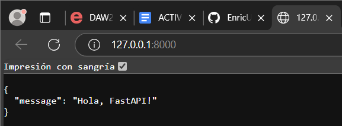
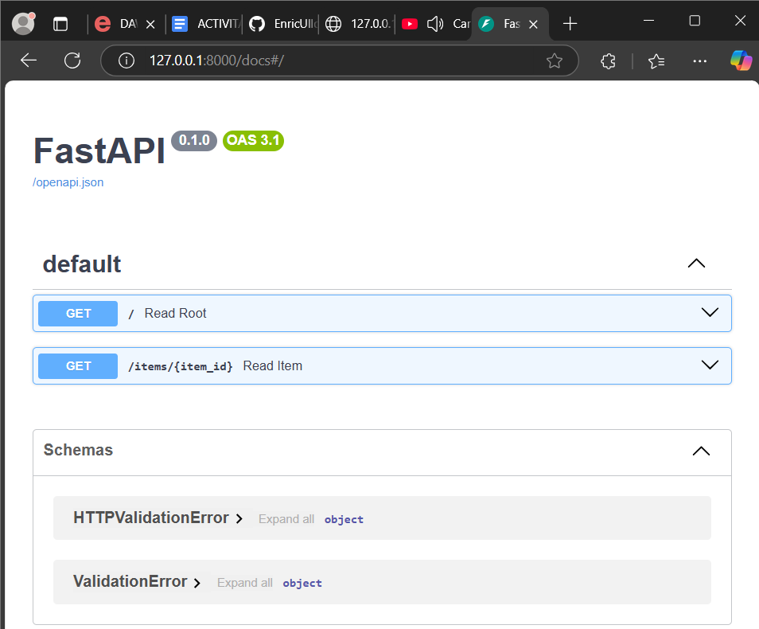
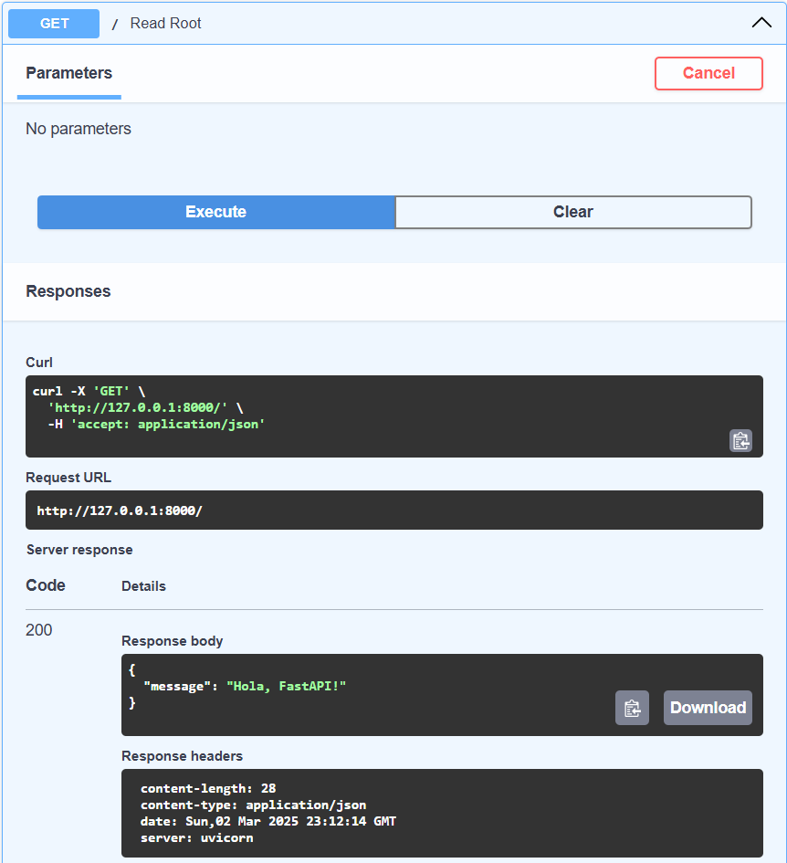
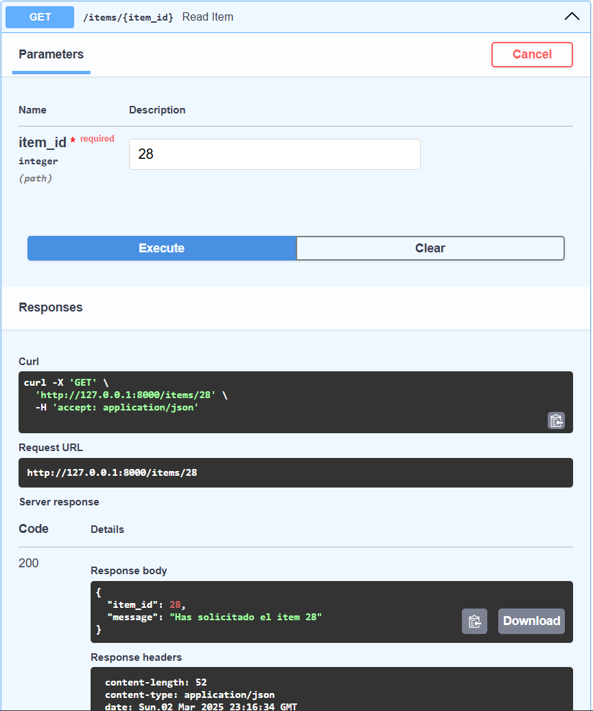
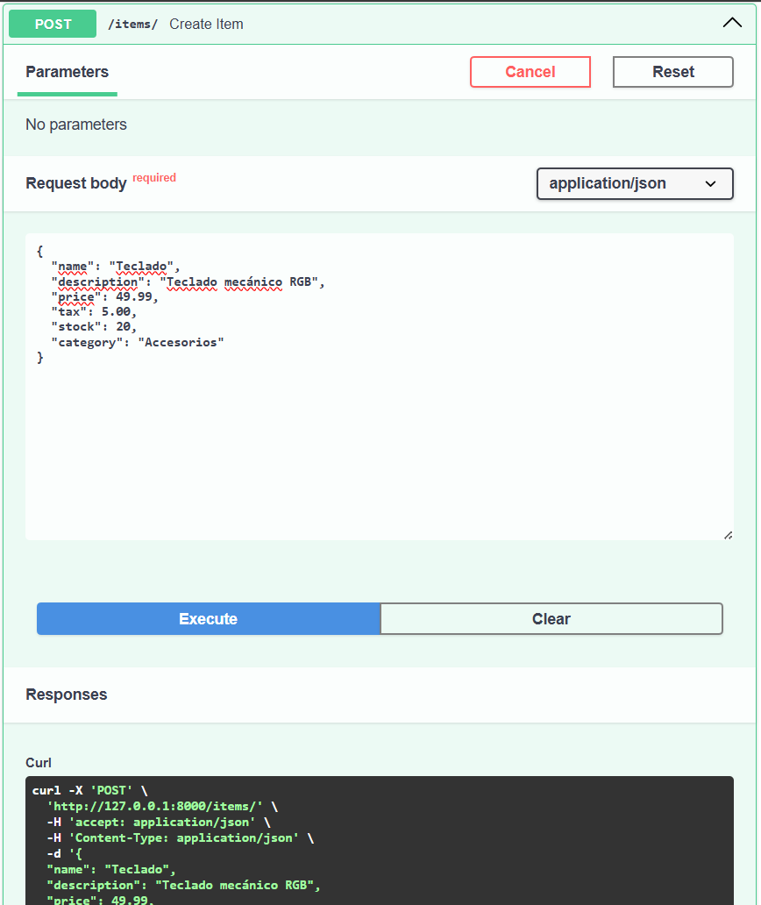
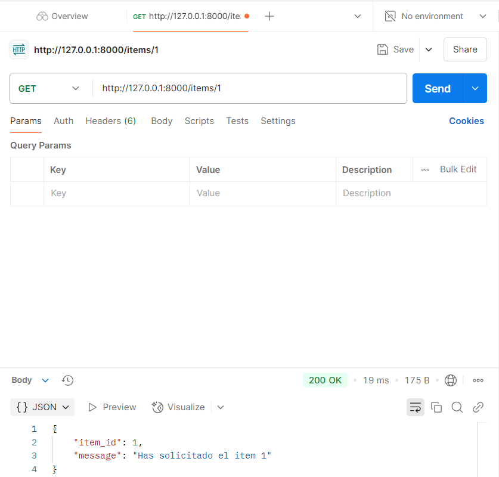
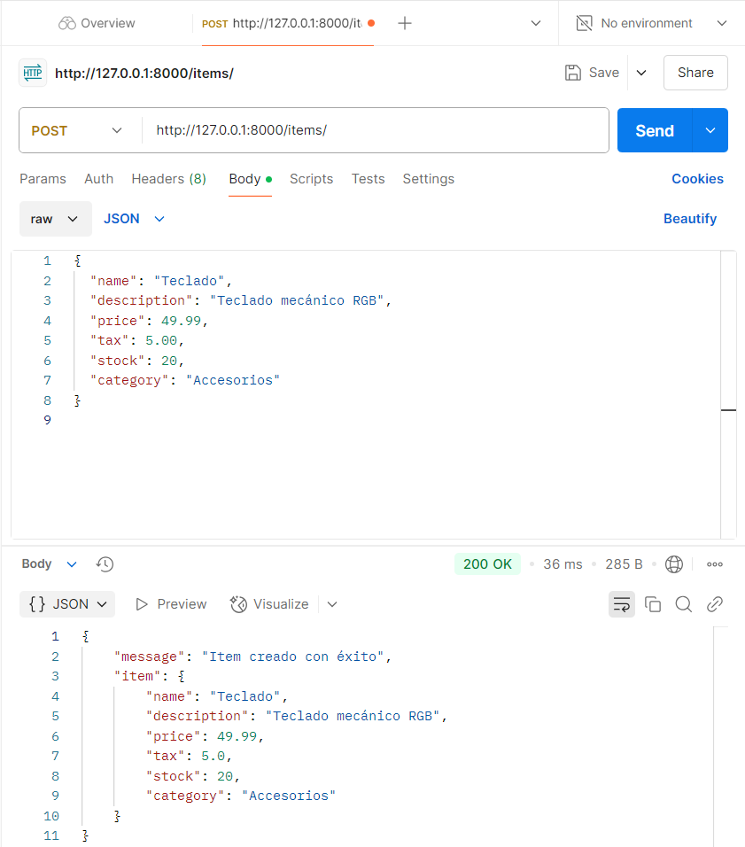

# ACTIVITAT 8 - INTRO FASTAPI

Primera visualizacion a la pagina:

 

### DOCS / SWAGGER

Docs:

 

Docs primer GET:

 

Swagger segundo GET:

 

Swagger POST:

 

 

### POSTMAN

GET:

 

POST:

 
