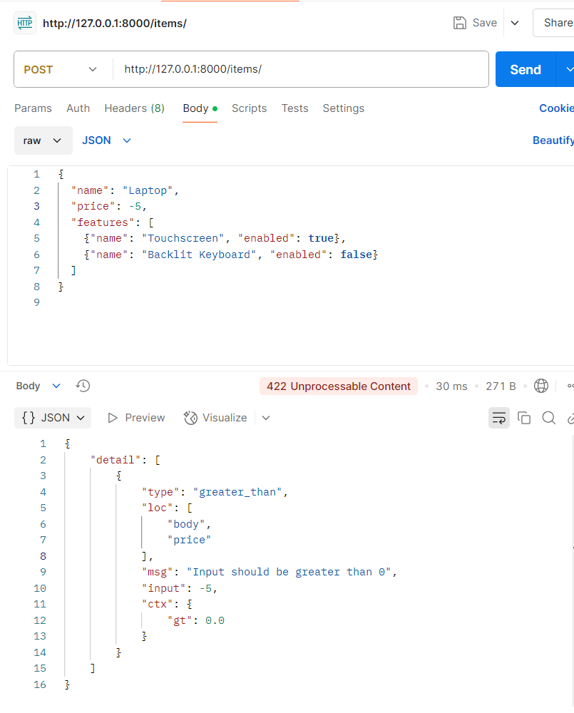

# ACTIVITAT 9 - FASTAPI + POSTGRESQL

Creando la database en PgAdmin4:

 

Primer visualizacion:

 

Primer visual en postman:

 

### POST /items/ - SWAGGER

 

 

### GET /users/ - SWAGGER

 

### POSTMAN - Prueba de los EndPoints

POST - prueba uno:

 

POST - prueba dos:

 

### SWAGGER - POST /products/

 

 

### POSTMAN - POST /products/

 

### Insercion de datos en pgadmin4

 

 

### Conectar FastAPI con PostgreSQL

Probar endpoint /users/

 

### ULTIMAS PRUEBAS DE VERIFICACION

#### Swagger

POST /items/

 

 

POST /products/

 

 

GET /users/

 

#### Postman

POST /items/ con datos válidos

 

POST /items/ con valores incorrectos

 

GET /users/

 

